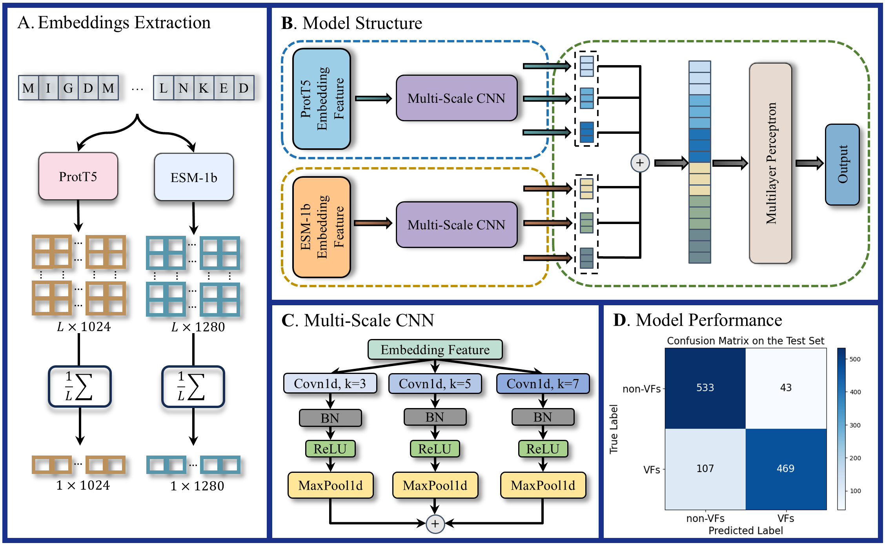

# PLM-VF  
The emergence of novel infectious diseases and the novel pathogenic properties of familiar diseases pose a significant global challenge. This issue is intricately linked to virulence factors (VFs) produced by pathogens. Here, we introduced a deep learning-based approach for predicting VFs that utilizes embeddings from the ProtT5 and ESM-1b models.  
  
* ProtT5: https://huggingface.co/Rostlab/prot_t5_xl_uniref50
* ESM-1b: https://huggingface.co/facebook/esm1b_t33_650M_UR50S
# Package requirement  
  pytorch==2.1.2  
  scikit-learn==1.5.1  
  pandas==2.2.2  
# Test on the model  

## Usage
Once your inputs are prepared, you can proceed to testing using the provided `test.py` script.
The `test.py` script is designed to accept arguments for the model file, test data path, and output path. To run the script, you must specify each of these parameters using the appropriate flags. Below is a general format for running the script:
```
python test.py -m [path_to_model] -i [path_to_test_data] -o [path_to_output]
```
Replace `[path_to_model]`, `[path_to_test_data]`, and `[path_to_output]` with the actual paths to your model file, test data file, and the output directory where you want the predictions CSV file saved, respectively.  
* `-m`, `--model_path`: Specifies the path to the model file. This argument is required.
* `-i`, `--test_data_path`: Specifies the path to the test data file. This argument is required.
* `-o`, `--output_path`: Specifies the path for saving the output CSV file. This argument is required.

## Example  
Following the general usage guidelines above, here’s a specific example of how to execute the `test.py` script: 
```
python test.py -m model/model.pt -i data/test_data.pt -o results/output.csv
```
Upon running the script, you will see the following output:
```
GPU Available  
TP: 469, FP: 43, TN: 533, FN: 107  
Acc: 0.8698, Recall: 0.8142, Spe: 0.9253, Pre: 0.9160, Auroc: 0.9406, F1: 0.8621, MCC: 0.7442  
Results saved to results\output.csv  
```
The `output.csv` file will be generated in the specified output directory. Here are the results for the first three samples from the `output.csv`:  
```
Labels	Predictions
0	0
0	0
0	0
```
# Use PLM-VF to predict VFs  

## Usage  
Once your inputs are prepared, you can proceed to predictions using the provided `prediction.py` script.
The `prediction.py` script is designed to accept arguments for the model file, input path, and output path. To run the script, you must specify each of these parameters using the appropriate flags. Below is a general format for running the script:
```
python prediction.py -m [path_to_model] -i [path_to_input] -o [path_to_output]
```
Replace `[path_to_model]`, `[path_to_input]`, and `[path_to_output]` with the actual paths to your model file, input directory, and the output directory where you want the predictions CSV file saved, respectively.  
* `-m`, `--model_path`: Specifies the path to the model file. This argument is required.
* `-i`, `--test_data_path`: Specifies the path to the input file. This argument is required.
* `-o`, `--output_path`: Specifies the path for saving the output CSV file. This argument is required.

## Example  
Following the general usage guidelines above, here’s a specific example of how to execute the `prediction.py` script: 
```
python prediction.py -m model/model.pt -i data/input.pt -o results/output.csv
```
After running the script, the `output.csv` file will be generated in the specified output directory. Here are the results for the `output.csv`:  
```
	Predictions
0	0
1	0
2	0
```
# Acknowledge  
The training and test sets come from DeepVF (DOI: 10.1093/bib/bbaa125).
